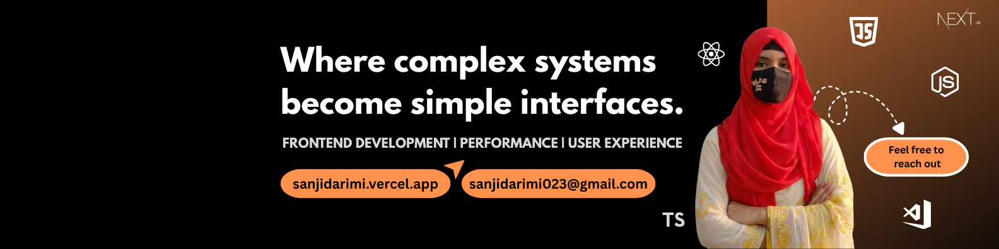

  

---

## 📖 About Me

I am a passionate **Web Developer** specializing in building scalable applications with the **MERN stack** and **Next.js**. I focus on clean architecture, efficient state management, and delivering high-performance user experiences.

---

## 🛠️ Tech Stack

### 🎨 Frontend

### ⚙️ Backend & Auth

### 🗄️ Database

### 🔧 Tools & Design

---

## 🚀 Featured Projects

### [APPLY_MATE](https://your-live-link.com) | Team Project

**AI-Powered Job Application Management**

- Implemented **Next Auth** for secure registration and **Zod** for robust data validation.
- Developed a clean, responsive UI using **React**, **Tailwind CSS**, and **Shadcn/UI**.
- _Tech: Next.js, TypeScript, MongoDB, Express.js, Vercel._

 

### [THE DAILY BULLETIN](https://your-live-link.com)

**Premium News Platform**

- Managed role-based dashboards (Admin, Premium, User) and integrated **Stripe** payments.
- Optimized data fetching with **TanStack Query** and visualized metrics using **Recharts**.
- _Tech: React.js, Node.js, Express.js, MongoDB, Firebase, Framer Motion._

 

### [BOOK GALAXY](https://your-live-link.com)

**Digital Library & Book Management**

- Built with **Firebase Authentication** and **JWT-protected** private routes.
- Features advanced CRUD operations and category-based filtering for an intuitive UX.
- _Tech: React.js, Tailwind CSS, Node.js, Express.js, MongoDB._

---

## Development Metrics

  
 

 

  

  

---

## 🎓 Education & Languages

- **Diploma in Engineering (Computer Science & CST)** - Kurigram Polytechnic Institute
- **Languages:** Bangla (Native) | English (Professional) | Hindi (Conversational)

  

